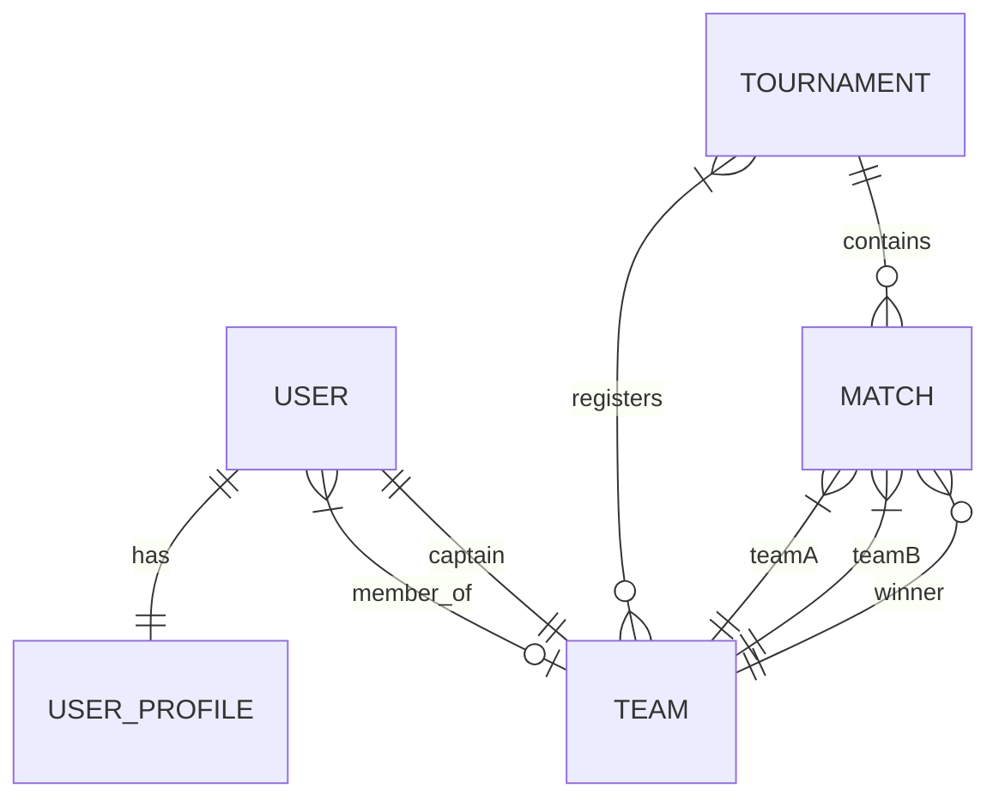

#  GameSphere - Enterprise Esports Tournament Management Platform


---

#  Overview

GameSphere is a **production-ready Enterprise Java Backend** application developed using **Java 21** and **Spring Boot 3** for managing esports tournaments.

The platform enables secure player registration, team management, tournament scheduling, match management, leaderboards, health monitoring, and Redis-powered caching through a scalable layered architecture following enterprise development practices.

The application demonstrates modern backend engineering concepts including:

- JWT Authentication
- Role-Based Authorization
- RESTful API Design
- PostgreSQL Persistence
- Redis Caching
- Docker Containerization
- CI/CD using GitHub Actions
- JUnit & Mockito Testing
- Hibernate Soft Delete
- JPA Auditing
- Layered Architecture

---

#  Features

## Authentication & Security

- JWT Authentication
- Stateless Security
- Role-Based Authorization
- Secure Password Encryption
- Spring Security Integration

Supported Roles

- PLAYER
- ADMIN

---

## User Management

- Register
- Login
- View Profile
- Update Profile
- Delete Account
- Player Statistics

---

## Team Management

- Create Team
- Join Team
- Leave Team
- Transfer Captaincy
- Remove Members
- Soft Delete Team

---

## Tournament Management

- Create Tournament
- Register Team
- Deregister Team
- Update Tournament
- Tournament Status Management
- Soft Delete

---

## Match Management

- Schedule Matches
- Update Match Status
- Record Match Results
- Automatic Statistics Calculation
- Team Win/Loss Updates

---

## Leaderboards

- Team Rankings
- Win Rate Calculation
- Pagination
- Sorting
- Filtering

---

## Health Monitoring

Health endpoint checks

- Application
- PostgreSQL
- Redis

Supports graceful degradation when Redis is unavailable.

---

## Redis Caching

Redis is used for

- Dashboard Statistics
- Leaderboards
- Frequently Requested Data

If Redis becomes unavailable, the application automatically falls back to database queries without affecting functionality.

---

## Data Integrity

- Soft Delete
- Hibernate SQLDelete
- SQLRestriction
- JPA Auditing
- Validation
- Exception Handling

---

#  System Architecture

```text
                    Client
                       │
                REST API Requests
                       │
        ┌────────────────────────────┐
        │ Spring Security (JWT Auth) │
        └────────────────────────────┘
                       │
                 REST Controllers
                       │
                 Service Layer
                       │
      ┌────────────────┴───────────────┐
      │                                │
 Repository Layer                Redis Cache
      │                                │
 PostgreSQL Database          Cached Responses
```

---

#  Project Structure

```
GameSphere
│
├── .github
│   └── workflows
│
├── src
│   ├── main
│   │
│   ├── config
│   ├── controller
│   ├── dto
│   ├── entity
│   ├── enums
│   ├── exception
│   ├── mapper
│   ├── repository
│   ├── security
│   ├── service
│   ├── util
│   └── validation
│
│
├── src/test
│
│   ├── controller
│   ├── repository
│   ├── service
│   └── resources
│
├── Dockerfile
├── docker-compose.yml
├── pom.xml
├── README.md
└── gamesphere.postman_collection.json
```

---

#  Technology Stack

## Language

- Java 21

---

## Framework

- Spring Boot 3.3
- Spring MVC
- Spring Security
- Spring Data JPA

---

## ORM

- Hibernate ORM

---

## Security

- JWT Authentication
- BCrypt Password Encoder

---

## Databases

- PostgreSQL
- H2 Database (Testing)

---

## Cache

- Redis

---

## Build Tool

- Maven

---

## Containerization

- Docker
- Docker Compose

---

## Testing

- JUnit 5
- Mockito
- Spring Boot Test

---

## CI/CD

- GitHub Actions

---

## Development Tools

- VS Code
- Git
- GitHub
- Postman
- pgAdmin 4

---

#  Database Entity Relationship



---

#  Core Entities

### User

Stores

- Login Credentials
- Roles
- Team Mapping

---

### User Profile

Stores

- Avatar
- Bio
- Wins
- Losses
- Win Rate

---

### Team

Stores

- Team Information
- Captain
- Members
- Statistics

---

### Tournament

Stores

- Tournament Details
- Registered Teams
- Tournament Status

---

### Match

Stores

- Team A
- Team B
- Winner
- Scores
- Match Status

---

#  Authentication Flow

```text
User Login
     │
     ▼
Spring Security
     │
Authenticate Credentials
     │
Generate JWT Token
     │
Client Stores Token
     │
Authorization Header
     │
Bearer Token
     │
JWT Filter
     │
Authorized Request
```

---

#  Configuration

## Requirements

- Java 21
- Maven 3.9+
- PostgreSQL
- Redis (Optional)
- Docker Desktop (Optional)

---

# Environment Variables

Copy

```
.env.example
```

to

```
.env
```

Example

```env
PORT=8080

DB_HOST=localhost
DB_PORT=5432
DB_NAME=gamesphere

DB_USERNAME=postgres
DB_PASSWORD=********

REDIS_HOST=localhost
REDIS_PORT=6379

JWT_SECRET=YOUR_SECRET_KEY
```

---

 🚀 Running Locally

Build

```bash
mvn clean install
```

Run

```bash
mvn spring-boot:run
```

Application

```
http://localhost:8080
```

Health Endpoint

```
http://localhost:8080/api/v1/health
```

---
#  Docker Deployment

GameSphere supports Docker for easy deployment and environment consistency.

## Build Docker Image

```bash
docker build -t gamesphere .
```

---

## Run using Docker Compose

```bash
docker compose up --build
```

This automatically starts:

- Spring Boot Backend
- PostgreSQL
- Redis

---

## Stop Containers

```bash
docker compose down
```

---

#  Testing

GameSphere follows a multi-layered testing strategy to ensure reliability and maintainability.

## Service Layer

- JUnit 5
- Mockito
- Business Logic Testing
- Exception Testing
- Validation Testing

---

## Controller Layer

- Spring Boot Test
- WebMvcTest
- MockMvc
- Spring Security Test

Verifies:

- Authentication
- Authorization
- Request Validation
- JSON Responses
- HTTP Status Codes

---

## Repository Layer

Uses

- DataJpaTest
- H2 Database
- PostgreSQL Compatibility Mode

Verifies

- CRUD Operations
- Pagination
- Sorting
- Custom Queries
- Soft Delete
- Entity Relationships

---

## Run Tests

```bash
mvn test
```

Build Verification

```bash
mvn clean install
```

---

## Test Summary

- ✅ 86 Tests
- ✅ 0 Failures
- ✅ 0 Errors
- ✅ Build Success

---

#  API Documentation

The project includes a complete Postman Collection.

Import:

```
gamesphere.postman_collection.json
```

Authentication uses:

```
Authorization: Bearer <JWT_TOKEN>
```

---

#  REST API Endpoints

## Authentication

| Method | Endpoint | Description |
|---------|----------|-------------|
| POST | `/api/v1/auth/register` | Register Player/Admin |
| POST | `/api/v1/auth/login` | Login & Generate JWT |

---

## Users

| Method | Endpoint |
|---------|----------|
| GET | `/api/v1/users/profile` |
| PUT | `/api/v1/users/profile` |
| DELETE | `/api/v1/users/account` |
| GET | `/api/v1/users` |

---

## Teams

| Method | Endpoint |
|---------|----------|
| POST | `/api/v1/teams` |
| GET | `/api/v1/teams` |
| GET | `/api/v1/teams/{id}` |
| POST | `/api/v1/teams/{id}/join` |
| POST | `/api/v1/teams/{id}/leave` |
| POST | `/api/v1/teams/{id}/transfer-captaincy` |
| DELETE | `/api/v1/teams/{id}` |
| DELETE | `/api/v1/teams/{id}/members/{memberId}` |

---

## Tournaments

| Method | Endpoint |
|---------|----------|
| POST | `/api/v1/tournaments` |
| GET | `/api/v1/tournaments` |
| GET | `/api/v1/tournaments/{id}` |
| GET | `/api/v1/tournaments/search` |
| PUT | `/api/v1/tournaments/{id}` |
| PATCH | `/api/v1/tournaments/{id}/status` |
| POST | `/api/v1/tournaments/{id}/register` |
| DELETE | `/api/v1/tournaments/{id}/deregister` |
| DELETE | `/api/v1/tournaments/{id}` |

---

## Matches

| Method | Endpoint |
|---------|----------|
| POST | `/api/v1/matches` |
| GET | `/api/v1/matches` |
| GET | `/api/v1/matches/{id}` |
| GET | `/api/v1/matches/team/{id}` |
| GET | `/api/v1/matches/tournament/{id}` |
| PATCH | `/api/v1/matches/{id}/status` |
| POST | `/api/v1/matches/{id}/result` |
| DELETE | `/api/v1/matches/{id}` |

---

## Leaderboard

| Method | Endpoint |
|---------|----------|
| GET | `/api/v1/leaderboard` |

---

## Dashboard

| Method | Endpoint |
|---------|----------|
| GET | `/api/v1/dashboard` |

---

## Health Check

| Method | Endpoint |
|---------|----------|
| GET | `/api/v1/health` |

---

#  Security Features

- JWT Authentication
- Stateless Session Management
- BCrypt Password Encoding
- Role-Based Authorization
- CSRF Protection for Testing
- Request Validation
- Global Exception Handling

---

#  Performance Optimizations

- Redis Caching
- Pagination
- Sorting
- Search APIs
- Lazy Loading
- DTO Mapping
- Service Layer Separation
- Repository Pattern

---

#  CI/CD

GitHub Actions automatically performs:

- Maven Build
- Unit Tests
- Controller Tests
- Repository Tests

Workflow:

```
Push / Pull Request
        │
GitHub Actions
        │
mvn clean install
        │
Run Tests
        │
Build Success ✅
```

---
#  Future Enhancements

- Email Notifications
- Live Match Tracking using WebSockets
- Tournament Bracket Visualization
- Swagger / OpenAPI Documentation
- AWS Deployment
- Kubernetes Deployment
- Prometheus Monitoring
- Grafana Dashboard
- Elasticsearch Integration
- API Rate Limiting

---

#  Project Highlights

✔ Enterprise Layered Architecture

✔ Spring Security JWT

✔ PostgreSQL

✔ Redis Caching

✔ Docker & Docker Compose

✔ RESTful APIs

✔ Hibernate ORM

✔ JPA Auditing

✔ Soft Delete

✔ Global Exception Handling

✔ Pagination & Sorting

✔ Comprehensive Testing

✔ GitHub Actions CI/CD

✔ Production Ready Backend

---

#  Author

**Prakash V**

Backend Java Developer

GitHub

```
https://github.com/prakashv120
```

Portfolio

```
https://portfolio28-six.vercel.app/
```

LinkedIn

```
(Add your LinkedIn profile URL here)
```

---

#  Contributing

Contributions, issues, and feature requests are welcome.

Feel free to fork the repository and submit pull requests.

---

#  License

This project is licensed under the MIT License.

---

#  Support

If you found this project helpful,

 Star the repository

 Fork the repository

 Share it with others

---

## Thank You ❤️
