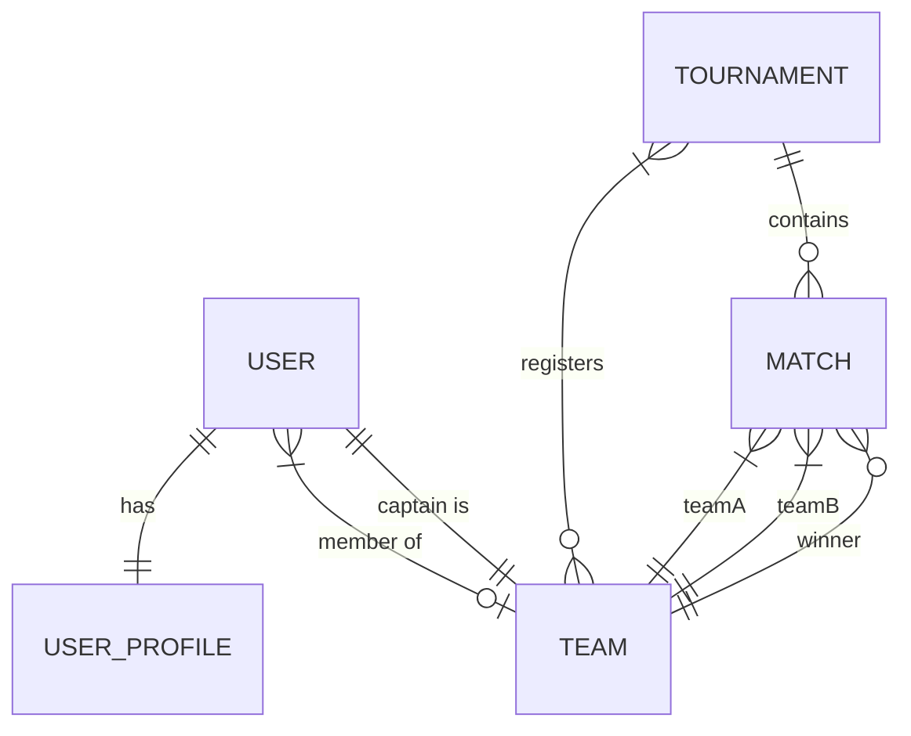

# GameSphere - Enterprise Esports Tournament Management Platform

GameSphere is a highly performant, production-ready backend application for managing esports tournaments, team registrations, match scheduling, result recording, and platform-wide leaderboards. It is designed with robust security, database constraints, caching mechanisms, and error resilience.

---

## 🚀 Key Features

*   **Secure Authentication & Authorization:** Custom JWT token authentication with role-based access control (`ROLE_PLAYER` and `ROLE_ADMIN`).
*   **Team Management:** Create teams, join/leave teams, transfer captaincy, and manage member rosters.
*   **Tournament Lifecycle:** Manage registration, active tournaments, team sign-ups, and soft-delete capabilities.
*   **Match Management:** Schedule tournament brackets, live status updates, and record match results with auto-computed win/loss stats.
*   **Dynamic Leaderboards:** Fast team standings computed dynamically by win rate, supported by pagination.
*   **System Health Checks:** Endpoint checking database and Redis connection health with degraded status reporting.
*   **Redis Caching with Fallback:** Enhanced performance using Redis caches, featuring graceful error fallback to directly query the database if Redis is offline.
*   **Data Integrity & Soft Delete:** Hibernate `@SQLDelete` and `@SQLRestriction` annotations prevent accidental data loss.

---

## 🛠️ Technology Stack

*   **Language:** Java 21
*   **Framework:** Spring Boot 3.3.0 (Spring MVC, Spring Security, Spring Data JPA)
*   **Security:** JSON Web Token (JWT) stateless auth
*   **Databases:** 
    *   PostgreSQL (Production/Development)
    *   H2 Database (In-Memory, Test-only)
*   **Cache:** Spring Data Redis
*   **Build Tool:** Maven
*   **Containerization:** Docker & Docker Compose
*   **CI/CD:** GitHub Actions

---

## 📊 Database Entity Model

The entity relationships are structured as follows:



*   **User:** Stores security credentials and links to user profile and team.
*   **UserProfile:** Holds player demographics (bio, avatar, wins, losses, win-rate).
*   **Team:** Represents esports teams, captain (User), and member list (Users).
*   **Tournament:** Captures tournament rules, registered teams (many-to-many), and bracket matches.
*   **Match:** Connects two teams inside a tournament, tracking score and status.

---

## ⚙️ Configuration & Environment Setup

### 1. Requirements
Ensure you have the following installed:
*   Java JDK 21
*   Maven 3.8+
*   Docker & Docker Compose (optional, for DB & Redis)

### 2. Environment Variables
Copy `.env.example` to `.env` in the root directory and modify it to match your local setup:
```bash
cp .env.example .env
```

Environment variable descriptions:
*   `PORT`: Port for the Spring Boot application (default: `8080`).
*   `DB_HOST`, `DB_PORT`, `DB_NAME`: PostgreSQL server connection parameters.
*   `DB_USERNAME`, `DB_PASSWORD`: PostgreSQL database credentials.
*   `REDIS_HOST`, `REDIS_PORT`: Connection endpoints for Redis caching.
*   `JWT_SECRET`: High-entropy 256-bit hexadecimal string for JWT signing.

---

## 🚀 Running the Application

### Option A: Local Dev Build
1. Start local PostgreSQL and Redis servers.
2. Build the project and run the server:
```bash
mvn clean install
mvn spring-boot:run
```

### Option B: Docker Compose (Fully Automated)
Build and spin up the backend application, PostgreSQL database, and Redis cache in unified containers:
```bash
docker compose up --build
```
This automatically configures the database schema and seeds default networking between containers.

---

## 🧪 Testing Strategy

GameSphere employs a multi-layered testing strategy to guarantee stability:

*   **Unit Tests (Service Layer):** Powered by JUnit 5 and Mockito, bypassing the Spring context for lightning-fast execution.
*   **Controller Slice Tests:** Utilizing `@WebMvcTest` and `spring-security-test` with CSRF tokens to test request mapping, input validation, status responses, and role authorization.
*   **Integration Repository Tests:** Configured with `@DataJpaTest` using an in-memory **H2 database** (in PostgreSQL compatibility mode).

To run the test suite:
```bash
mvn test
```

Test configurations are managed under `src/test/resources/application-test.yml`.

---

## 🛰️ API Documentation

All API endpoints are documented and easily accessible. You can import the included Postman collection:
*   📂 **Postman Collection:** `gamesphere.postman_collection.json`

### Core Endpoint Summary

| Category | Endpoint | Method | Role | Description |
| :--- | :--- | :--- | :--- | :--- |
| **Auth** | `/api/v1/auth/register` | `POST` | Public | Register a new User account |
| **Auth** | `/api/v1/auth/login` | `POST` | Public | Authenticate user and receive JWT |
| **User** | `/api/v1/users/profile` | `GET` | Player/Admin | Retrieve current profile details |
| **Team** | `/api/v1/teams` | `POST` | Player | Create a new esports team |
| **Team** | `/api/v1/teams/{id}/join` | `POST` | Player | Join a team (must not be in one) |
| **Tournament** | `/api/v1/tournaments` | `POST` | Admin | Create a new tournament |
| **Tournament** | `/api/v1/tournaments/{id}/register` | `POST` | Player | Sign up a team for a tournament |
| **Match** | `/api/v1/matches` | `POST` | Admin | Schedule a new match |
| **Match** | `/api/v1/matches/{id}/result` | `POST` | Admin | Record score and update stats |
| **Leaderboard** | `/api/v1/leaderboard` | `GET` | Public | Retrieve team standings |
| **System** | `/api/v1/health` | `GET` | Public | Check service dependency health status |
